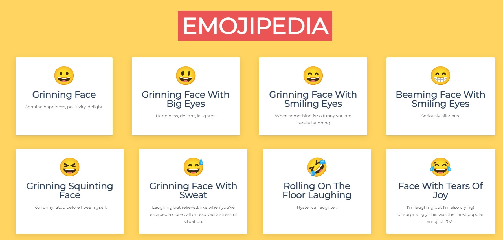
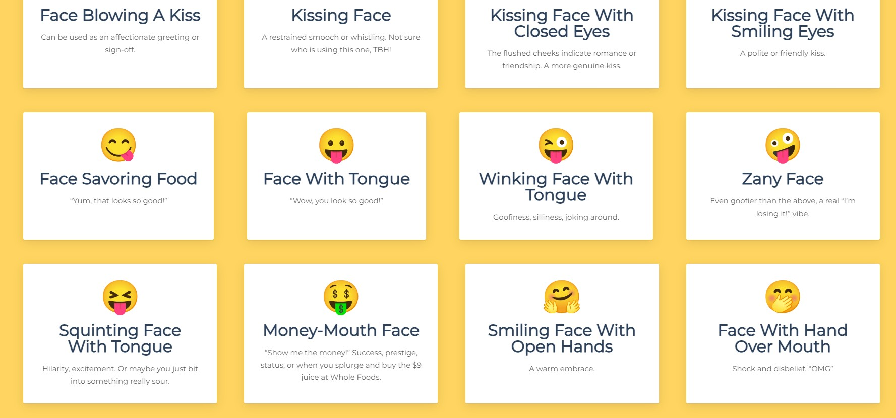

# Emojipedia

Emojipedia is your go-to resource for emojis, providing a thorough compilation with each emoji accompanied by a detailed name and description. Whether you're a casual user seeking to grasp the significance of a particular emoji or a developer in need of precise information for seamless emoji integration, Emojipedia is your one-stop solution.

## Technologies Used

The technologies and tools were used to develop this project are reactJS & JavaScript

## Getting Started

Follow these steps to get the project up and running on your local machine for development and testing:

### Prerequisites

Make sure you have the following requirements met:

- Latest version of npm and Node.js installed.
- Windows/Linux/Mac machine.

### Installation

1. Clone the repository

   ```bash
   git clone https://github.com/username/projectname.git
   ```

2. Move into the project directory

   ```bash
   cd projectname
   ```

3. Install the dependencies

   ```bash
   npm install
   ```

4. Run the below command to start the web server.

   ```bash
   npm start
   ```

   Open link that shows up in the terminal, with your browser to see the result.

## Screenshots





## Contributing

Contributions to Emojipedia are welcome! To contribute, follow these steps:

1. Fork the repository.
2. Create a new branch for your feature or bug fix:

   ```bash
   git checkout -b feature/your-feature-name
   ```

3. Make changes and commit them:

   ```bash
   git commit -m "Add your commit message here"
   ```

4. Push your changes to your branch:

   ```bash
   git push origin feature/your-feature-name
   ```

5. Create a pull request on the main repository.

Please follow the project's coding guidelines and maintain a clean commit history.

## License

This website is licensed under the MIT License. See the [LICENSE](LICENSE) file for details.

## Contact

If you have any questions or feedback, feel free to reach out to us at <therahman14@gmail.com>. We're excited to hear from you and make this project even better!
